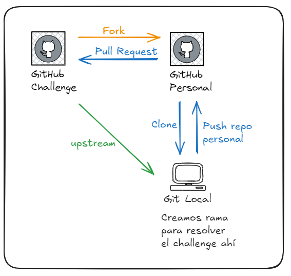
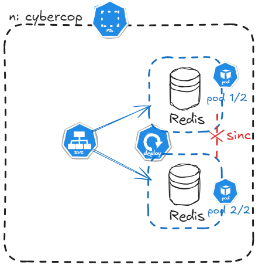
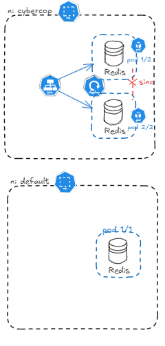
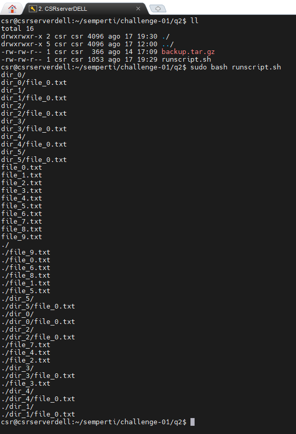
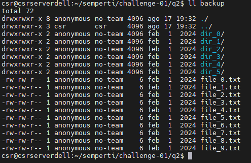
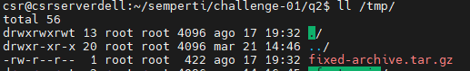
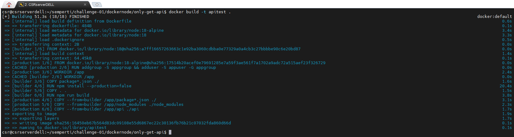
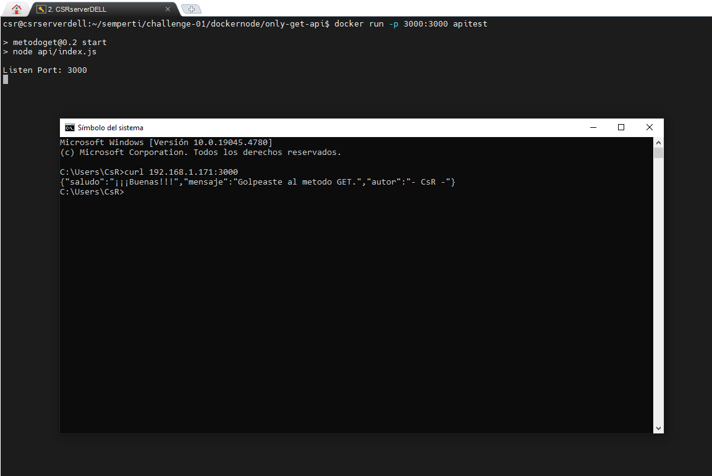
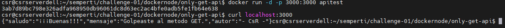

# Desafios de DevOps - Solución

- [Desafios de DevOps - Solución](#desafios-de-devops---solución)
  - [Git](#git)
    - [Fuentes](#fuentes)
  - [K8s deployment](#k8s-deployment)
    - [Fuentes](#fuentes-1)
  - [Linux Automation](#linux-automation)
    - [Fuentes](#fuentes-2)
  - [Docker Multi-Stage Build Exercise](#docker-multi-stage-build-exercise)
    - [Problemas](#problemas)
    - [Fuentes](#fuentes-3)

## Git

De acuerdo con las indicaciones generales, los pasos a seguir para utilizar el sistema de control de versiones Git para resolver el challenge son los siguientes:




Desde la [página de GitHub donde se encuentra el challenge](https://github.com/semperti-bootcamp/challenge-01), hacemos clic en el botón **Fork** para crear una copia del repositorio. De esta manera, evitamos añadir colaboradores con acceso para realizar push.

Una vez completado este paso, podemos clonar el repositorio a nuestra PC, pero esta vez desde nuestro repositorio personal y el comando para realizar tal tarea es `git clone git@github.com:csrodriguez/challenge-01.git`. 

Ahora generamos un remote llamado upstream que apunte al repo original mediante `git remote add upstream https://github.com/semperti-bootcamp/challenge-01.git`. Esto lo hacemos para mantener el fork actualizado con los cambios que se realizen en repositorio original por medio de los siguientes comandos `git fetch upstream` y `git merge upstream/main`. 

Creamos la rama donde realizaremos los cambios mediante `git checkout -b solution`, vemos que aca utilizamos directamente con checkout pero con el modificador '-b' para que lo cree, sino habria que crearlo primero con *branch* y luego hacer el *checkout* para crearlo y cambiarnos a dicha rama. Ahora podemos realizar los cambios necesarios, podemos usar el editor VS Code ejecutando `code .`.

Una vez realizado los cambios, procedemos a subirlos a nuestro repo. Para eso primero agregamos todos los cambios con `git add .`, confirmamos dichos cambios con `git commit -m "Mensaje referente a los cambios realizados"` y para subir los commit de la rama solution al repositorio remoto `git push origin solution`.

Finalmente, generamos un Pull Request, seleccionando el repositorio original como la base y nuestra rama **solution** como la head.

```bash
# 1- Realizar Fork desde la web del repositorio original

# 2- Generar clone de nuestro repo personal
git clone git@github.com:csrodriguez/challenge-01.git

# 3- Crear remote upstream
git remote add upstream https://github.com/semperti-bootcamp/challenge-01.git
git fetch upstream
git merge upstream/main

# 4- Crear rama donde haremos los cambios
git checkout -b solution

# 5- Realizamos los cambios pertinentes. Podemos utilizar un VS Code por ejemplo:
# code .

# 6- Subir los cambios al repositorio personal
git add .
git commit -m "Mensaje referente a los cambios realizados"
git push origin solution

# 7- Generar Pull Request desde la pagina de nuestro repositorio
```

### Fuentes
  
* [Excalidraw - Generar bocetos](https://excalidraw.com/)
* [Git](https://git-scm.com/)
* [GitHub - Fork](https://docs.github.com/es/pull-requests/collaborating-with-pull-requests/working-with-forks/fork-a-repo)
* Google, ChatGPT

## K8s deployment

Vamos a crear nuestro cluster de Kubernetes utilizando [Minikube](https://minikube.sigs.k8s.io/docs/). Para su instalacion podemos usar la guia que nos ofrece en la misma [página web Get Started!](https://minikube.sigs.k8s.io/docs/start/?arch=%2Fwindows%2Fx86-64%2Fstable%2F.exe+download).

Pero en nuestro caso para utilizar minikube utilizaremos [Vagrant](https://www.vagrantup.com/). Primero vamos a [instalar VirtualBox](https://www.virtualbox.org/wiki/Downloads) y luego [instalar Vagrant](https://developer.hashicorp.com/vagrant/install?product_intent=vagrant). En ambos casos se encuentran los pasos necesarios segun el Sistema Operativo. Los boxes para vagrant los podemos encontrar [aqui](https://portal.cloud.hashicorp.com/vagrant/discover), y la vamos a utilizar es [ilionx/ubuntu2204-minikube](https://app.vagrantup.com/ilionx/boxes/ubuntu2204-minikube).

Finalizada la instalación de ambos softwares, abrimos una terminal y nos posicionamos en una carpeta de trabajo para ejecutar dicho boxes. Ahi ejecutamos los comandos de inicializacion, para levantarlo y para ejecutar la conexion mediante ssh:

```bash
vagrant init ilionx/ubuntu2204-minikube
vagrant up
vagrant ssh
```

Este box ya tiene configurado el contexto del cluster para `kubectl`, y el mismo se encuentra en su ruta por default (~/.kube/config), por lo que no hace falta configurarlo en las variables (con *export KUBECONFIG=ruta/completa/config*).

Vamos a crear el archivo special-definition.yml y editarlo con **vi**, para esto ejecutamos `vi special-definition.yml`, ahi escribimos o pegamos su contenido. Si estamos en una ventana de CMD de Windows, para pegar el codigo nos puede generar problemas de identacion, una forma de solucionar adentro de vi, es ejecutando el comando **:set paste** y luego pegamos el texto. Despues podemos deshabilitarlo con **:set nopaste**. 

Veamos su contenido a continuacion:

special-definition.yml
```yaml
apiVersion: v1
kind: Namespace
metadata:
  name: cyberco

---

apiVersion: apps/v1
kind: Deployment
metadata:
  name: cache-db
  namespace: cyberco
spec:
  replicas: 2
  selector:
    matchLabels:
      app: redis
  template:
    metadata:
      labels:
        app: redis
    spec:
      containers:
      - name: redis
        image: redis:buster
        ports:
        - containerPort: 6379

---

apiVersion: v1
kind: Service
metadata:
  name: cache-db-service
  namespace: cyberco
spec:
  selector:
    app: redis
  ports:
  - protocol: TCP
    port: 6379
    targetPort: 6379

```
En este archivo yaml vamos a estar configurando tres recursos de Kubernetes, un namespace, un deployment y un servicio. Cada uno de esto lo vamos a estar separando con "---". Y cada uno lo vamos a estar diferencia en el valor de "kind:"

Entonces para el para definir el namespace, en **kind** tiene que tener **Namespace**. El nombre "cyberco" se lo asignamos en **"metadato.name"**.

Para administrar el conjunto de replicas de pods vamos a utilizar el deployment, **kind: Deployment**. En **metadata.name** le asignamos el nombre y en **metadata.namespace** le decimos a que namespace lo asignamos, que en este caso sera cyberco. La cantidad de replicas (2 en nuestro caso), se lo indicamos en **spec.replicas**. Con **spec.selector.matchLabels** lo utilizamos para seleccionar los pods que coincidad con dicha etiqueta ("app: redis"). En **spec.template.spec.containers.name** el nombre del contenedor, con **spec.template.spec.containers.image** la imagen, con su tag, Docker a utilizar, y en **spec.template.spec.containers.ports.containerPort** el puerto expuesto en el contenedor.

El **kind: Service** lo utilizamos para exponerlo mediante una unica direccion IP. Con **metadata.name** le damos un nombre al servicio, y con **metadata.namespace** a que namespace lo asignamos. En **spec.selector.app** en redis, seleccionamos los pods con dicha etiqueta ("app: redis"). Ahora en **spec.port.protocol** el protocolo de comunicacion (TCP), en **spec.port.port** el puerto que expone servicio, y **spec.port.targetPort** hacia que puerto redirige a los pods.

Para aplicar éste archivo utilizamos el siguiente comando:

```bash
 kubectl apply -f special-definition.yml
```

Un error que se me presento en este caso fue el siguiente: (Tener en cuenta que en vez de llamar al archivo special-definition.yml, lo llame redis.yml)

```bash
vagrant@ubuntu2204:~$ kubectl apply -f redis.yml
Error from server (Invalid): error when creating "redis.yml": Namespace "CyberCo" is invalid: metadata.name: Invalid value: "CyberCo": a lowercase RFC 1123 label must consist of lower case alphanumeric characters or '-', and must start and end with an alphanumeric character (e.g. 'my-name',  or '123-abc', regex used for validation is '[a-z0-9]([-a-z0-9]*[a-z0-9])?')
Error from server (NotFound): error when creating "redis.yml": namespaces "CyberCo" not found
Error from server (NotFound): error when creating "redis.yml": namespaces "CyberCo" not found
```

Lo que nos indica que hace una validacion de nombre y se ve que no admite mayusculas, por lo que se le paso a editarlo el archivo y poner en nombre de Namespace todo minusculas. Y finalmente al hacer el `kubectl apply -f archivo` fue exitoso:

```bash
vagrant@ubuntu2204:~$ kubectl apply -f redis.yml
namespace/cyberco created
deployment.apps/cache-db created
service/cache-db-service created
```

Podemos obtener informacion de cada uno de ellos (`kubectl get namespaces`, `kubectl get all -n cyberco`):

```bash
vagrant@ubuntu2204:~$ kubectl get namespaces
NAME              STATUS   AGE
cyberco           Active   63s
default           Active   149d
kube-node-lease   Active   149d
kube-public       Active   149d
kube-system       Active   149d

vagrant@ubuntu2204:~$ kubectl get all -n cyberco
NAME                           READY   STATUS    RESTARTS   AGE
pod/cache-db-5d8594db5-gsb9m   1/1     Running   0          86s
pod/cache-db-5d8594db5-sg4bv   1/1     Running   0          86s

NAME                       TYPE        CLUSTER-IP     EXTERNAL-IP   PORT(S)    AGE
service/cache-db-service   ClusterIP   10.101.18.27   <none>        6379/TCP   86s

NAME                       READY   UP-TO-DATE   AVAILABLE   AGE
deployment.apps/cache-db   2/2     2            2           86s

NAME                                 DESIRED   CURRENT   READY   AGE
replicaset.apps/cache-db-5d8594db5   2         2         2       86s

```

Pasemos ahora a hacer unas pruebas en los contenedores para ver si funciona redis, utilizamos `kubectl exec -n nombre-namespace -it nombre-pod -- /bin/bash`. Para conectarse a base de datos utilizamos `redis-cli -h <host> -p <puerto> -a <password>`, y ahi adentro podemos por ejemplo hacer un "ping", crear una clave-valor con "set", y obtener el valor con "get clave".
`

```Bash
vagrant@ubuntu2204:~$ kubectl get pods -n cyberco
NAME                       READY   STATUS    RESTARTS   AGE
cache-db-5d8594db5-gsb9m   1/1     Running   0          3m6s
cache-db-5d8594db5-sg4bv   1/1     Running   0          3m6s

vagrant@ubuntu2204:~$ kubectl exec -n cyberco -it cache-db-5d8594db5-gsb9m -- /bin/bash
root@cache-db-5d8594db5-gsb9m:/data#

root@cache-db-5d8594db5-gsb9m:/data# redis-cli
127.0.0.1:6379> ping
PONG
127.0.0.1:6379> set idolo "idoloVos"
OK
127.0.0.1:6379> get idolo
"idoloVos"
127.0.0.1:6379> exit
root@cache-db-5d8594db5-gsb9m:/data# exit
exit
```

Ahora ingresaremos en el redis del otro pod y veremos que tenemos un problema de que no estan sincronizadas las bases de datos al querer obtener el valor con dicha clave. Y luego desde ese pod nos conectamos al redis del otro pod indicandole la direccion IP, para ver que si la tiene.

```bash
vagrant@ubuntu2204:~$ kubectl get pods -n cyberco
NAME                       READY   STATUS    RESTARTS   AGE
cache-db-5d8594db5-gsb9m   1/1     Running   0          16m
cache-db-5d8594db5-sg4bv   1/1     Running   0          16m
vagrant@ubuntu2204:~$ kubectl exec -n cyberco -it cache-db-5d8594db5-sg4bv -- /bin/bash
root@cache-db-5d8594db5-sg4bv:/data# redis-cli
127.0.0.1:6379> get idolo
(nil)
127.0.0.1:6379> exit
root@cache-db-5d8594db5-sg4bv:/data# exit
exit
vagrant@ubuntu2204:~$ kubectl get pods -o wide -n cyberco
NAME                       READY   STATUS    RESTARTS   AGE   IP           NODE         NOMINATED NODE   READINESS GATES
cache-db-5d8594db5-gsb9m   1/1     Running   0          18m   172.17.0.4   ubuntu2204   <none>           <none>
cache-db-5d8594db5-sg4bv   1/1     Running   0          18m   172.17.0.3   ubuntu2204   <none>           <none>
vagrant@ubuntu2204:~$ kubectl exec -n cyberco -it cache-db-5d8594db5-sg4bv -- /bin/bash
root@cache-db-5d8594db5-sg4bv:/data# redis-cli -h 172.17.0.4
172.17.0.4:6379> get idolo
"idoloVos"
172.17.0.4:6379> exit
root@cache-db-5d8594db5-sg4bv:/data# exit
exit
```



Otra prueba que podemos hacer sobre este tema de la sincronizacion es creando otro deployment que vemos a continuacion:

test.yml
```yaml
apiVersion: apps/v1
kind: Deployment
metadata:
  name: testredis
  namespace: default
spec:
  replicas: 1
  selector:
    matchLabels:
      app: redis
  template:
    metadata:
      labels:
        app: redis
    spec:
      containers:
      - name: redis
        image: redis:buster
```

Aplicamos este archivo con `kubectl apply -f test.yml`. Buscamos la direccion de ip del servicio que creamos con `kubectl get svc -n cyberco`. Nos conectamos al contenedor de la app test y nos conectamos con redis apuntando hacia la direccion ip que obtuvimos antes `redis-cli -h 10.101.18.27`. Ahi tratamos de obtener la clave:valor, salimos y volvemos a ejecutar. Vemos que en un momento nos va a dar la informacion deseada y en la otra no. Esto sucede porque el servicio en un momento nos va a estar enviando a un pod o a otro. En un momento vemos que quize utilzar el nombre del servicio pero me habia equivocado en como se resuelve el nombre ya que se encuentra en otro namespace y mas abajo fue corregido escribiendo el nombre completo.


```bash
vagrant@ubuntu2204:~$ vagrant@ubuntu2204:~$ kubectl apply -f test.yml
deployment.apps/testredis created
vagrant@ubuntu2204:~$ kubectl get pods -n default
NAME                        READY   STATUS    RESTARTS   AGE
testredis-846b5cd97-hpvbz   1/1     Running   0          30s
vagrant@ubuntu2204:~$ kubectl get svc -n cyberco
NAME               TYPE        CLUSTER-IP     EXTERNAL-IP   PORT(S)    AGE
cache-db-service   ClusterIP   10.101.18.27   <none>        6379/TCP   23m
vagrant@ubuntu2204:~$ kubectl exec -ti -n default testredis-846b5cd97-hpvbz -- /bin/bash
root@testredis-846b5cd97-hpvbz:/data# redis-cli -h cache-db-service
Could not connect to Redis at cache-db-service:6379: Name or service not known
not connected> exit
root@testredis-846b5cd97-hpvbz:/data# redis-cli -h 10.101.18.27
10.101.18.27:6379> get idolo
(nil)
10.101.18.27:6379> exit
root@testredis-846b5cd97-hpvbz:/data# redis-cli -h 10.101.18.27
10.101.18.27:6379> get idolo
(nil)
10.101.18.27:6379> exit
root@testredis-846b5cd97-hpvbz:/data# redis-cli -h 10.101.18.27
10.101.18.27:6379> get idolo
"idoloVos"
10.101.18.27:6379> exit
root@testredis-846b5cd97-hpvbz:/data# redis-cli -h cache-db-service.cyberco.svc.cluster.local
cache-db-service.cyberco.svc.cluster.local:6379> exit
root@testredis-846b5cd97-hpvbz:/data# exit
exit
```



### Fuentes
  
* [kubernetes](https://kubernetes.io/es/docs/home/)
* [Deployment](https://kubernetes.io/docs/concepts/workloads/controllers/deployment/)
* [Minikube](https://minikube.sigs.k8s.io/docs/)
* [Documentacion de Vagrant](https://developer.hashicorp.com/vagrant/docs)
* [Redis](https://redis.io/docs/latest/)
* [redis-cli](https://redis.io/docs/latest/operate/rs/references/cli-utilities/redis-cli/)
* [Comandos de Redis](https://redis.io/docs/latest/commands/)
* [https://redis.io/learn/operate/redis-at-scale/high-availability/understanding-sentinels](https://redis.io/learn/operate/redis-at-scale/high-availability/understanding-sentinels)
* [Redis Enterprise for Kubernetes operator-based architecture](https://redis.io/docs/latest/operate/kubernetes/architecture/operator/)
* [Excalidraw - Generar bocetos](https://excalidraw.com/)
* Google, ChatGPT


## Linux Automation

runscript.sh
```bash
#!/bin/bash

# Variables
user_chg="anonymous"
group_chg="no-team"
dir_destino="./backup/"

mkdir "$dir_destino"

tar -xzvf backup.tar.gz -C "$dir_destino"

#cd backup
cd "$dir_destino"
find -type f -exec chmod 0664 {} \;
find -type d -exec chmod 0775 {} \;
cd ..

# Verificar si el usuario y grupo existe, cambiar propietario y grupo

#if ! id -u "$user_chg" >/dev/null 2>&1; then
#               if ! getent group "$group_chg" >/dev/null 2>&1; then
#                               chown -R anonymous:no-team "$dir_destino"
#               else
#                               echo "El grupo '$group_chg' no existe."
#                               echo "No se cambia el propietario y grupo"
#               fi
#else
#    echo "El usuario '$user_chg' no existe."
#               echo "No se cambia el propietario y grupo"
#fi

if ! id -u "$user_chg" > /dev/null 2>&1; then
    useradd "$user_chg"
fi

if ! getent group "$group_chg" > /dev/null 2>&1; then
    groupadd "$group_chg"
fi

chown -R "$user_chg":"$group_chg" "$dir_destino"

tar -czvf /tmp/fixed-archive.tar.gz -C ./backup/ .
```

Con el shebang le indicamos el interprete, utilizado si le damos permiso de ejecucion al archivo. Creamos unas variables para utilizar durante el script. Luego creamos un directorio donde descomprimiremos el archivo y que no se mezcle con los otros archivos. Con el comando tar vamos a descomprimir el archivo mediante el modificador x, con z le indicamos que es un gzip, con v que nos muestre mas informacion, con f el archivo a descomprimir, y con C la carpeta de destino.

Accedemos a la carpeta con cd, esto lo hacemos para que despues no se modifique el permiso de esta carpeta que creamos. Con find buscamos archivos o directorios mediante type, y con exec dependiendo de si es uno u otro le aplicamos el permiso correspondiente mediante chmod.

Luego verificamos si es que existe un grupo y usuario en particular, y si no existe se los crea.

Con chown cambiamos de propietario con el usuario y grupo que se creo en el paso anterior si es que no existia.

Finalmente, creamos el archivo con tar mediante el modificador c, con f le indicamos como se va a llamar y donde va a estar, con -C la fuente de los archivos y con el punto (.) todos los archivos.

Para ejecutar el script hacemos `sudo bash runscript.sh`, y usamos sudo debido a que hay comandos que se va a necesitar privilegios.

```bash
sudo bash runscript.sh
```

En la siguiente imagen vemos la ejecucion del script:


Como quedaron los permisos y propietarios de los archivos y directorios:


El archivo creado en /tmp:



### Fuentes
  
* [tar](https://www.gnu.org/software/tar/manual/tar.html#Introduction)
* `man` en Linux
* [Bash manual](https://www.gnu.org/software/bash/manual/)
* Google, ChatGPT


## Docker Multi-Stage Build Exercise

Veamos primero el archivo Dockerfile:

```Dockerfile
# Etapa Builder
FROM node:18 AS builder
WORKDIR /app
COPY package*.json ./
RUN npm install --production=false
COPY . .
RUN npm run build

# Etapa Producción
FROM node:18-alpine AS production
RUN addgroup -S appgroup && adduser -S appuser -G appgroup
WORKDIR /app

COPY --from=builder /app/package*.json ./
COPY --from=builder /app/node_modules ./node_modules
COPY --from=builder /app/api ./api
# COPY --from=builder /app/dist ./dist
USER appuser

EXPOSE 3000

CMD ["npm", "start"]
```

En la primera parte la llamamos Builder (por medio **AS builder**) para asi mas adelante poder referenciarla con ese nombre, y utilizamos la image de node.js version 18. Con WORKDIR establecemos la carpeta de trabajo en el contenedor con el nombre /app. Copiamos todos los archivos que comienzen con package y terminen con .json desde el directorio donde estamos ejecutando el Dockerfile (mas adelante veremos el filesystem con el que trabajamos). Luego instalamos todas las independencias y nos aseguramos que sean las de desarrollo como las de produccion con el modificador de production. A continuacion con el COPY copiamos todos los demas archivos al directorio de trabajo del contenedor. Finalizando ésta etapa ejecutamos el script de build definido en package.json (utilizado para compilar el codigo a una version optimizada para produccion) y puede generar una carpeta /dist para la distribucion. Este ultimo, en caso de nuestra compilacion no lo requiere, y no genera dicha carpeta, y es por este motivo que se comenta la linea que copia esta carpeta, mas adelante en el Dockerfile.


En la segunda parte que llamamos Produccion, usamos una imagen mas liviana de node en Alpine Linux. Luego creamos un creamos un usuario y grupo para no ejecutar la aplicacion como root. Volvemos a establecer el directorio de trabajo en /app. A continuacion copiamos los archivos de la etapa builder a la etapa produccion. Con USER appuser cambiamos a dicho usuario y no usar el root. Exponemos en el puerto 3000. Finalmente definimos el comando que ejecutaremos al iniciar el contenedor a partir de esta imagen.

Podemos utilizar un .dockerignore para que no se copien archivos que no queremos en la imagen. Por ejemplo:

.dockerignore
```
README.md
```

La aplicacion en node.js que utilize para probar dicho Dockerfile es [only-get-api](https://github.com/csrodriguez/only-get-api/tree/master). Clonamos el proyecto en nuestro servidor con `git clone git@github.com:csrodriguez/only-get-api.git`. Y copiamos o creamos los archivos Dockerfile y .dockerignore. Nuestro filesystem debe quedar:

```
.
├── api
│   └── index.js
├── Dockerfile
├── package.json
├── package-lock.json
└── README.md
```

Creamos la imagen con `docker build -t apitest .` y ejecutamos el contenedor a partir de dicha imagen con `docker run -p 3000:3000 apitest` o `docker run -d -p 3000:3000 apitest`. Luego podemos hacer simplemente un `curl localhost:3000` ya que estamos probando metodo GET.

En la siguiente imagen vemos la creacion de la imagen:


A continuacion probando desde otro maquina utilizando la direccion IP del servidor:


Y en este caso probando desde la misma maquina donde se corre el contenedor:



### Problemas

* Algunos complicaciones que hubo, es que en la aplicacion que desarrolle no tenia definido en package.json un build. Lo cual se desarrollo uno que solo haga un echo.

* Otro referente al anterior es que como no genera ninguna carpeta dist, me generaba error al intentar copiarla a la etapa de produccion.

* El siguiente error: 
```
> metodoget@0.1 start
> node api/index.js

node:internal/modules/cjs/loader:1143
  throw err;
  ^

Error: Cannot find module '/app/api/index.js'
    at Module._resolveFilename (node:internal/modules/cjs/loader:1140:15)
    at Module._load (node:internal/modules/cjs/loader:981:27)
    at Function.executeUserEntryPoint [as runMain] (node:internal/modules/run_main:128:12)
    at node:internal/main/run_main_module:28:49 {
  code: 'MODULE_NOT_FOUND',
  requireStack: []
}
```
Se debia a que no habia copiado de la etapa builder a la produccion la aplicacion que estaba en /api

### Fuentes

* [Dockerfile](https://docs.docker.com/reference/dockerfile/)
* [Multi-Stage](https://docs.docker.com/build/building/multi-stage/)
* Google, ChatGPT